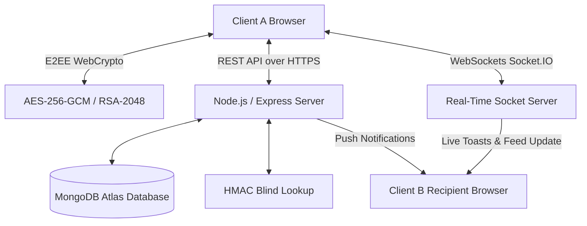
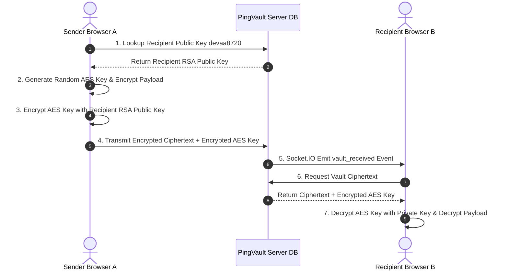

# 🛡️ PingVault – Enterprise Zero-Knowledge Secure File & Payload Sharing Platform


PingVault is a zero-knowledge, end-to-end encrypted (E2EE) secure file and confidential note transmission platform designed for high-security environments. By pairing browser-native WebCrypto RSA-2048 and AES-256-GCM cryptography with real-time WebSocket event streaming, PingVault allows users to share confidential documents, credentials, and encrypted notes without ever exposing raw unencrypted data to server storage or network intermediaries.

---

## 📑 Table of Contents

- [Project Overview](#-project-overview)
- [Problem Statement](#-problem-statement)
- [Vision & Objectives](#-vision--objectives)
- [Key Features](#-key-features)
- [Target Users](#-target-users)
- [Use Cases](#-use-cases)
- [Business Value](#-business-value)
- [System Architecture](#-system-architecture)
  - [High-Level Architecture](#high-level-architecture)
  - [Zero-Knowledge E2EE Key Exchange Sequence](#zero-knowledge-e2ee-key-exchange-sequence)
- [Technology Stack](#-technology-stack)
- [Project Folder Structure](#-project-folder-structure)
- [API Overview](#-api-overview)
- [Vercel & Production Cloud Deployment Guide](#-vercel--production-cloud-deployment-guide)
- [Development Prerequisites](#-development-prerequisites)
- [Environment Setup](#-environment-setup)
- [Running the Project](#-running-the-project)
- [Security & Compliance](#-security--compliance)
- [License](#-license)

---

## 🚀 Project Overview

PingVault addresses the fundamental vulnerability of modern cloud communication: central servers having access to unencrypted file content. In PingVault, encryption and key generation occur exclusively inside the client's Web Browser using the native W3C WebCrypto API. 

Each user generates a permanent public User ID (e.g. `devaa8720`) tied to an RSA-2048 keypair. Payload data—whether confidential notes, API keys, passwords, or multi-format binary files up to 50MB—is encrypted with a fresh AES-256-GCM symmetric key. That symmetric key is encrypted individually for each target recipient's public key. The server only sees and stores ciphertext, initialization vectors (IV), and authentication tags.

---

## 🎯 Problem Statement

Traditional file sharing services store files unencrypted at rest or hold decryption keys on cloud infrastructure. This leaves sensitive data vulnerable to:
1. Server-side breaches and database leaks.
2. Insider threats and unauthorized administrative access.
3. Network interception and MITM attacks during payload transit.
4. Lack of granular recipient access controls and instant revocation.

---

## 🌟 Vision & Objectives

PingVault provides a production-ready, zero-trust file transmission infrastructure where:
- **Zero-Knowledge Guarantee**: Neither server administrators nor database operators can inspect payload contents.
- **Bi-Directional Multi-User Sharing**: Any account can securely send and receive encrypted payloads to one or many recipients.
- **Instant Real-Time Feeds**: WebSockets push instant notifications, deliver shares, and propagate deletions across all active devices without page refreshes.
- **Granular Life-Cycle Controls**: Customizable time-based expiry (minutes to days), view-based limits, secondary password locks, self-destruct rules, and manual revocation.

---

## 🔥 Key Features

- **🔐 End-to-End Encryption (E2EE)**: Browser-level WebCrypto RSA-OAEP + AES-256-GCM encryption.
- **🆔 Public User ID Directory**: Simple username-derived public User IDs (e.g. `devaa8720`) with automated public key exchange.
- **⚡ Real-Time WebSocket Event Pipeline**: Powered by Socket.IO for immediate multi-device toast notifications and feed updates.
- **🔔 Premium Glassmorphic Toast Notifications**: Non-blocking floating notifications with hover pause, auto-dismiss, and direct action triggers.
- **📄 Dual Payload Handling**: Clean direct text rendering for confidential notes and formatted download cards for multi-format binary files (PDF, ZIP, DOCX, Images).
- **⏱️ Flexible Expiration Rules**: Time duration timers, view count caps, secondary master passwords, and self-destruct 1-view rules.
- **📊 Detailed Transmission Audit Logs**: Track creation timestamps, view count metrics, and individual recipient decryption statuses.
- **💾 Permanent Database Persistence**: Vaults remain safely stored in MongoDB until explicitly deleted by the sender or recipient.

---

## 🏗️ System Architecture

### High-Level Architecture



### Zero-Knowledge E2EE Key Exchange Sequence



---

## 🛠️ Technology Stack

| Layer | Technology | Description |
| :--- | :--- | :--- |
| **Frontend Core** | React 18 + TypeScript | UI architecture and component lifecycle |
| **Build Tooling** | Vite v6 | Ultra-fast HMR and production bundling |
| **Styling** | Vanilla CSS + TailwindCSS | Dark-mode glassmorphic styling |
| **Icons** | Lucide React | Modern vector icon suite |
| **Client Cryptography**| WebCrypto API (W3C) | RSA-OAEP & AES-256-GCM native browser encryption |
| **Backend Core** | Node.js + Express.js | RESTful API controllers and middleware |
| **Real-Time Engine** | Socket.IO v4 | WebSocket bidirectional event broadcasting |
| **Database & ODM** | MongoDB + Mongoose | Document database for encrypted vaults & logs |
| **Server Security** | Helmet, Bcrypt, Zod | Input validation, headers, and security middleware |

---

## ⚡ API Overview

| Endpoint | Method | Description |
| :--- | :--- | :--- |
| `/api/v1/auth/register` | `POST` | Registers new user with public RSA key & salt |
| `/api/v1/auth/login` | `POST` | Authenticates user & returns JWT tokens |
| `/api/v1/auth/me` | `GET` | Fetches active user profile & encrypted private key |
| `/api/v1/receivers/lookup/:receiverId` | `GET` | Validates target User ID & returns RSA public key |
| `/api/v1/vaults/create` | `POST` | Creates and transmits an encrypted vault payload |
| `/api/v1/vaults/received` | `GET` | Retrieves all incoming encrypted vaults for user |
| `/api/v1/vaults/created` | `GET` | Retrieves all outbound sent vaults & audit logs |
| `/api/v1/vaults/open/:vaultId` | `POST` | Validates access rules and returns vault payload |
| `/api/v1/vaults/revoke` | `POST` | Revokes recipient access to a sent vault |
| `/api/v1/vaults/delete/:vaultId` | `DELETE` | Permanently deletes sent vault & logs (Sender) |
| `/api/v1/vaults/received/delete/:sharedId` | `DELETE` | Removes received vault from inbox (Recipient) |
| `/api/v1/activity` | `GET` | Fetches security audit activity trail |

---

## 🌐 Vercel & Production Cloud Deployment Guide

### Yes! Hosting on Vercel is 100% Supported and Recommended for Frontend Client Deployment.

Because PingVault utilizes a hybrid architecture (React Single-Page Application on Frontend + Express Node.js & Socket.IO WebSockets on Backend), the recommended production deployment strategy is:

### 1. Frontend Client Deployment (Vercel)
- **Platform**: Vercel
- **Root Directory**: `client`
- **Build Command**: `npm run build`
- **Output Directory**: `dist`
- **Configuration**: Vercel configuration file (`client/vercel.json`) handles SPA route rewrites automatically.

### 2. Backend Server & Socket.IO Engine Deployment (Render / Railway / Fly.io / Heroku)
- **Platform**: Render, Railway, or Fly.io (which support persistent Node.js servers & WebSocket daemons).
- **Environment Variables**:
  - `MONGO_URI`: Your MongoDB Atlas URI.
  - `JWT_SECRET`: Secret key for JWT signing.
  - `CLIENT_URL`: Your Vercel frontend URL (e.g. `https://pingvault.vercel.app`).

---

## ⚙️ Development Prerequisites

Ensure you have the following installed on your host system:
- **Node.js**: `v18.0.0` or higher
- **npm**: `v9.0.0` or higher
- **MongoDB**: Local MongoDB instance or MongoDB Atlas Connection URI

---

## 📦 Environment Setup

Create a `.env` file in the `server` directory:

```env
PORT=5000
NODE_ENV=development
MONGO_URI=mongodb://localhost:27017/pingvault
JWT_SECRET=your_super_secret_jwt_key_32_bytes_long
JWT_REFRESH_SECRET=your_super_secret_refresh_jwt_key
CLIENT_URL=http://localhost:5173
```

---

## 🚀 Running the Project Locally

```bash
# Install Dependencies & Start Server (http://localhost:5000)
cd server
npm install
npm run dev

# Install Dependencies & Start Client (http://localhost:5173)
cd ../client
npm install
npm run dev
```

---

## 📄 License

Distributed under the **MIT License**. See `LICENSE` for more details.
